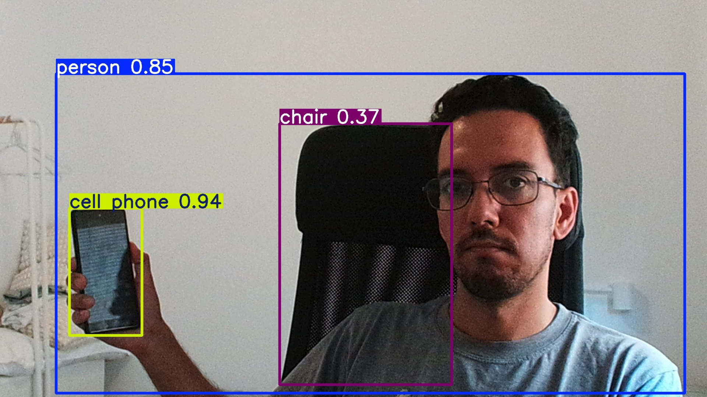

# Object Detection with YOLO and OpenCV

This project captures images using a webcam, performs object detection using the YOLO model, and saves both the original and annotated images.

## Example

Original image:


Annotated image:



## Requirements

- Python 3.x
- OpenCV
- Ultralytics YOLO

## Installation

1. Clone the repository:

    ```sh
    git clone <repository_url>
    cd <repository_directory>
    ```

2. Create a virtual environment and activate it:

    ```sh
    python -m venv venv
    source venv/bin/activate  # On Windows use `venv\Scripts\activate`
    ```

3. Install the required packages:

    ```sh
    # TODO
    pip install -r requirements.txt
    ```

## Usage

1. Ensure your webcam is connected.

2. Run the script:

    ```sh
    python main.py
    ```

3. The script will capture an image, perform object detection, and save the images in the current directory.

## More information

- [YOLOv8 ultralytics](https://github.com/ultralytics/ultralytics) - YOLOv8, is a real-time object detection and image segmentation model
- [OpenCV](https://docs.opencv.org/4.x/) - OpenCV (Open Source Computer Vision Library) is an open-source computer vision and machine learning software library.
